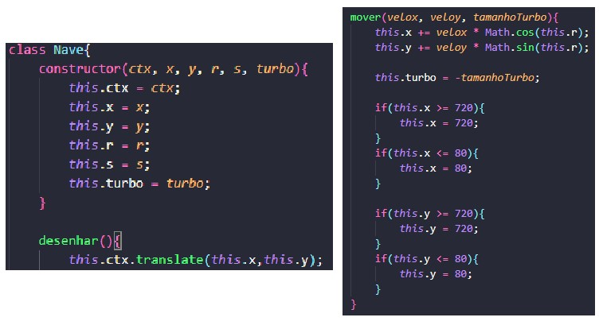
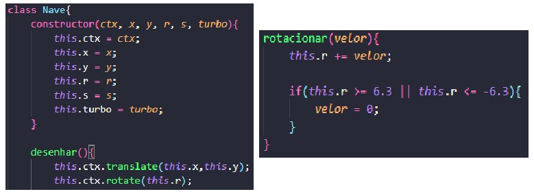
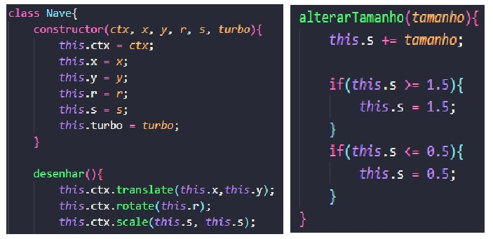
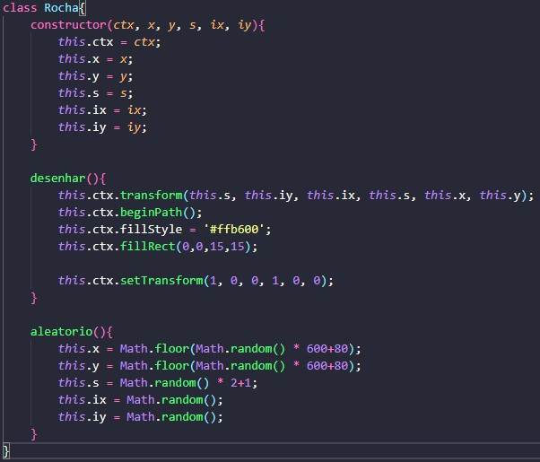
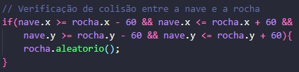
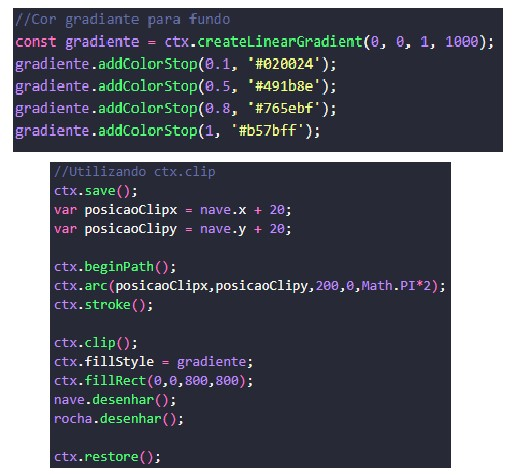
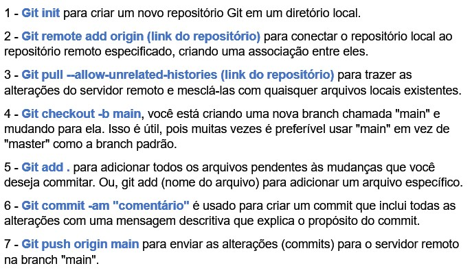

# Cena com transformações

Feito por Cauã Silva e Gabriel Faria 2ºJogos digitais

# Translate

O translate() é um método que adiciona movimento a um objeto em suas unidades x (horizontalmente) e y (verticalmente) para move-lo em sua tela.

Criamos uma classe chamada "Nave", e nela adicionamos o translate para move-la no eixo X e Y automaticamente.

No método desenhar, está tudo que foi utilizado para formar a nave, e no mover, está os códigos responsáveis por alterar o valor de x e y adicionados no translate, junto com condições para que a nave não atravesse os limites da tela do canvas no eixo x e y. A nave para se a tecla de espaço for clicada, e volta a andar se for clicada novamente.

O resultado será mostrado junto com o Rotate().

# Rotate

O rotate() é um método que faz com que o objeto gire em torno do seu proprio eixo, em nossa cena o objeto se move automaticamente e é guiado atravez do rotate para mudar sua trajetoria, com a tecla "A" rodando a nave no sentido anti-horário, e a tecla "D" rodando a nave no sentido horário.

## Resultado do Rotate com o Translate
https://github.com/CauaSilva28/cena-com-transformacoes/assets/127631052/b46fb9bc-9778-4321-9276-248d466333b2

# Scale 

O scale() é um método que modifica a escala de um objeto desejado multiplicando seu valor inicial pelo número adicionado dentro do código "ctx.scale(n1,n2)", sendo o primeiro número(n1) o valor que vai multiplicar a escala no eixo x (horizontalmente) e o segundo número(n2) o valor que vai multiplicar a escala no eixo y(verticalmente). 

Foram adicionadas as mesmas variaveis no eixo x e y do "scale()" para que a nave cresça e diminuá proporcionalmente. Ao clicar na tecla "Q", a nave irá diminuir até certo tamanho, e ao clicar na tecla "E", a nave irá aumentar até certo tamanho.

## Resultado do Scale
https://github.com/CauaSilva28/cena-com-transformacoes/assets/127631052/d5d120a0-1e0c-4622-ba7a-9e10de6d9f27

No final do método "mover()" da nave foi adicionado o código ctx.setTransform(1,0,0,1,0,0) que é responsável por redefinir a transformação do objeto para seu estado original, assim fazendo com que o "translate()", "rotate()" e "scale()" da nave não altere outros objetos.

# Transform

O transform() utiliza matriz para transformar um objeto. Na matriz pode-se alterar a posição (x, y) como um translate(), a inclinação vertical e horizontal e o seu tamanho como o scale().

Em nossa cena, o tranform foi utilizado em um objeto que será a rocha e irá aparecer no canvas com suas posições x e y, inclinação no eixo x e y e tamanho todos aleatórios. Para isso criamos uma classe chamada "Rocha" e nela colocamos todos os métodos e atributos necessários.

Toda vez que a nave colidir com a rocha, será calculado um novo valor aleatório para as posições x e y, inclinação no eixo x e y e tamanho.

## Colisão entre nave e rocha

## Resultado do transform e colisão
https://github.com/CauaSilva28/cena-com-transformacoes/assets/127631052/07a4e7c3-0397-45d4-86c4-c1f1a0085ff1

# Clipping Path

Por fim, o "Clipping Path" cria uma máscara de recorte(no formato que você criar) por cima de outra forma. Tudo que for colocado após o código "ctx.clip()", será visível apenas dentro da área da máscara de recorte no formato desenhado (no nosso caso foi um círculo).

Após o código "ctx.clip()" colocamos apenas um retângulo com cor gradiante nos tons de roxo para simular o espaço. A máscara de recorte é um circulo que ficará em volta da nave tendo as mesmas posições que ela para andarem juntas. Colorimos o background do canvas de preto para parecer que a máscara de corte em volta da nave seja a luz dela, assim revelando o espaço de acordo com a posição da nave.

O resultado do Clipping Path já foi mostrado em todos os vídeos anteriores.

# Comandos do git utilizados

